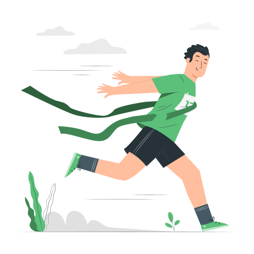

<p align="center"></p>
<p>
  <a href="https://storyset.com/sport">Sport illustrations by Storyset</a>
</p>
<h1 align="center">PROTOTYPE 🐱‍👤</h1>

<p align="center">
  <a href="https://github.com/Shirajuki/ideal-potato/blob/main/LICENSE" alt="LICENSE">
    
  </a>
  <a href="https://github.com/Shirajuki/ideal-potato/issues" alt="Issues">
    
  </a>
</p>

A Work In Progress JS 2D multiplayer top-down game 🏃‍♂️

## Built With

- JavaScript
- React framework + Webpack
- HTML5
- SCSS
- Service Workers (PWA)
- WebSocket (Socket.io)

<hr />

## Get started

Install the dependencies...

```bash
cd topdown-proto
npm install
```

...then start Webpack:

```bash
npm start
```

Navigate to [localhost:3000](http://localhost:3000). You should see your app running. Edit a component file in `src`, save it, and reload the page to see your changes.

PWA will be configured following this [tutorial](https://codelabs.developers.google.com/codelabs/your-first-pwapp)

## Building and running in production mode

To create an optimised version of the app:

```bash
npm run build
```

## License

Distributed under the MIT License. See [`LICENSE`](./LICENSE) for more information.
